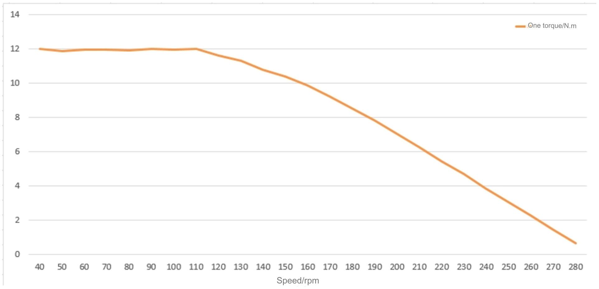
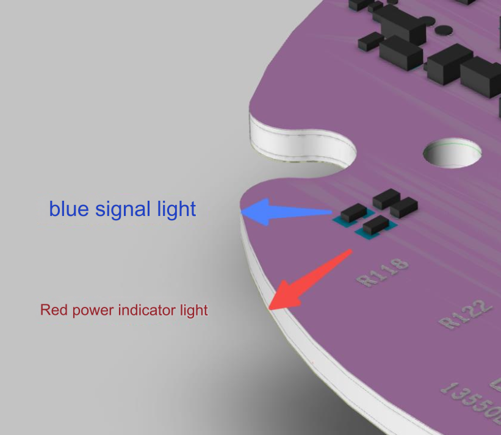

# CyberGear micromotor instruction manual

### Table of contents

Table of contents

Precautions

Legal Notices

After-sales policy

1. Motor specifications and parameters
    1. Appearance and installation dimensions
    2. Standard usage status
    3. Electrical characteristics
    4. Mechanical properties
2. Drive product information
    1. Driver Appearance Introduction & Product Specifications
    2. Driver interface definition
        1. Driver interface diagram
        2. Recommended brands and models of drive interfaces
        3. Driver interface pin definition
    3. Drive indicator light definition
    4. Main components and specifications
3. Debugger usage instructions
    1. Hardware Configuration
    2. Debugger interface and instructions
    3. Motor settings
    4. Control demo
    5. Firmware update
4. Driver communication protocol and usage instructions
    1. Communication protocol type description
    2. Control mode usage instructions

### Precautions

1. Please use it according to the working parameters specified in this article, otherwise it will cause serious damage to this product!
2. The control mode cannot be switched while the joint is running. If you need to switch, you need to send a stop command before switching.
3. Please check whether all parts are intact before use. If parts are missing or damaged, please contact technical support in time.
4. Do not disassemble the motor at will to avoid irrecoverable faults.
5. Make sure there is no short circuit when connecting the motor and the interface is connected correctly as required.

### Legal Notices
    
Before using this product, the user must read this manual carefully and operate the product in accordance with the contents of this manual. If the user uses this product in violation of the contents of this manual, the company does not assume any responsibility for any property damage or personal injury accidents. Since this product consists of many parts, do not let children come into contact with this product to avoid accidents. In order to extend the service life of the product, please do not use this product in high temperature and high pressure environments. This manual has tried its best to include various function introductions and usage instructions at the time of printing. However, due to the continuous improvement of product functions, design changes, etc., there may still be discrepancies with the products purchased by users.

There may be differences between this manual and the actual product in terms of color, appearance, etc. Please refer to the actual product. This manual is published by Xiaomi or its local subsidiaries. Xiaomi may make necessary improvements and changes to this manual for typographical errors, inaccuracies of the latest information, or improvements to programs and/or equipment at any time without prior notice. Such changes will be uploaded to the new version of this manual, please scan the QR code of this manual to obtain it. All pictures are for functional description only, please refer to the actual product.

### After-sales policy

The after-sales service of this product is strictly in accordance with the "Consumer Rights and Interests Protection Law of the People's Republic of China" and the "Product Quality Law of the People's Republic of China". The service content is as follows:
1. Warranty period and content
    1. Users who place an order to purchase this product through online channels can enjoy a no-reason return service within seven days from the day of receipt. When returning goods, users must present a valid proof of purchase and return the invoice. Users must ensure that the returned goods maintain their original quality and functionality, their appearance is intact, and the trademarks and logos of the goods themselves and accessories are complete. If there are any gifts, they must be returned together. If the product is damaged artificially, dismantled manually, the packaging box is missing, or the spare parts are missing, returns will not be processed. The logistics costs incurred when returning goods shall be borne by the user (see "After-sales Service Charging Standards" for charging standards). If the user fails to settle the logistics fees, the actual amount will be deducted from the refund amount. The paid price will be returned to the user within seven days from the date of receipt of the returned goods. Refund methods are the same as payment methods. The specific arrival date may be affected by factors such as banks and payment institutions.
    2. If non-human-damaged performance failure occurs within 7 days from the day after the user signs for it, the Xiaomi after-sales service center will handle the return business for the user after inspection and confirmation. When returning the product, the user must present a valid purchase certificate and return the invoice. Any gifts must be returned together.
    3. If non-human damage or performance failure occurs within 7 days to 15 days from the day after the user signs for it, Xiaomi after-sales service center will handle the exchange business for the user and replace the entire set of products after inspection and confirmation. After the exchange, the three-guarantee period of the product itself will be recalculated.
    4. From 15 days to 365 days from the day after the user signs for it, after inspection and confirmation by the Xiaomi after-sales service center, it is a quality failure of the product itself, and repair services can be provided free of charge. The replaced faulty product belongs to Xiaomi Company. Non-faulty product will be returned in its original condition. This product leaves the factory after undergoing various strict tests. If there is any quality failure that is not related to the product itself, we will have the right to refuse the user's return or exchange request.

    If the after-sales policy in this manual is inconsistent with the store’s after-sales policy, the store’s after-sales policy shall prevail.

2. Non-warranty regulations: The following situations are not covered by the warranty:
    1. Exceeds the warranty period limited by the warranty terms.
    2. Product damage caused by incorrect use without following the instructions.
    3. Damage caused by improper operation, maintenance, installation, modification, testing and other improper use.
    4. Conventional mechanical loss and wear caused by non-quality faults.
    5. Damage caused by abnormal working conditions, including but not limited to falling, impact, liquid immersion, violent impact, etc.
    6. Damage caused by natural disasters (such as floods, fires, lightning strikes, earthquakes, etc.) or force majeure.
    7. Damage caused by use beyond peak torque.
    8. Items that are not genuine Xiaomi products may not be able to provide legal proof of purchase.
    9. Other failures or damages not caused by problems such as product design, technology, manufacturing, quality, etc.
    10. Use this product for commercial purposes.

If the above situation occurs, users need to pay the fees themselves.  
For details of the group’s after-sales policy, please see: [https://www.mi.com/service/serviceAgreement?id=17](https://www.mi.com/service/serviceAgreement?id=17)

### 1. Motor specifications

#### 1.1 Appearance and installation dimensions

#### 1.2 Standard usage status

1.2.1 Rated voltage: 24 VDC  
1.2.2 Operating voltage range: 16V—28 VDC  
1.2.3 Rated load (CW): 4 N.m  
1.2.4 Running direction: CW/CCW viewed from the direction of the shaft  
1.2.5 Usage posture: The axis direction is horizontal or vertical  
1.2.6 Standard operating temperature: 25±5°C  
1.2.7 Operating temperature range: -20~50°C  
1.2.8 Standard operating humidity: 65%  
1.2.9 Operating humidity range: 5~85%, no condensation  
1.2.10 Storage temperature range: -30~70°C  
1.2.11 Insulation level: Class B

#### 1.3 Electrical characteristics

1.3.1 No-load speed: 296 rpm±10%  
1.3.2 No-load current: 0.5 Arms  
1.3.3 Rated load: 4 N.m  
1.3.4 Rated load speed: 240rpm±10% 1.3.5 Rated load current (peak): 6.5A±10% 1.3.6 Peak load: 12 N.m  
1.3.7 Peak current (peak value): 23A±10%  
1.3.8 Insulation resistance/stator winding: DC 500VAC, 100M Ohms 1.3.9 High voltage resistance/stator and casing: 600 VAC, 1s, 2mA 1.3.10 Motor back electromotive force: 0.054-0.057Vrms/rpm  
1.3.11 Line resistance: 0.45Ω±10%  
1.3.12 Torque constant: 0.87N.m/Arms  
1.3.13 Motor inductance: 187-339μH  
1.3.14 T-N curve  

1.3.15 Maximum overload curve Test conditions:

Ambient temperature: 25°C  
Winding limit temperature: 120°C  
Speed:24rpm  

Maximum load curve

Maximum overload time (s) vs Torque(N.m)

Test Data

| Load | Operating time (s) |
|------|--------------------|
|12.00 | 28                 |
|11.00 | 45                 |
|10.00 | 60                 |
| 9.00 | 90                 |
| 8.00 | 160                |
| 7.00 | 320                |
| 6.00 | 700                |
| 5.00 | 1800               |
| 4.50 | 2500               |
| 4.00 | rated              |

#### 1.4 Mechanical properties

1.4.1 Weight: 317g±3g  
1.4.2 Number of poles: 28 poles
1.4.3 Number of phases: 3 phases  
1.4.4 Drive mode: FOC  
1.4.5 Reduction ratio: 7.75:1

### 2. Drive product information

#### 2.1 Driver appearance introduction & product specifications

1. 24V power supply and CAN communication integrated terminal;
2. Hardware version and laser engraving QR code;
3. MCU download port;
4. CAN communication test point;
5. Indicator light;
6. Installation holes; 7. “C, A, B” are the three-phase winding welding points;

Product specifications

|                                                |                                 |
|------------------------------------------------|---------------------------------|
|Rated operating voltage                         |24VDC                            |
|Maximum allowed voltage                         |28VDC                            |
|Rated operating current                         |6.5A                             |
|Maximum allowed current                         |23A                              |
|Standby power consumption                       |≤18mA                            |
|CAN bus bit rate                                |1Mbps                            |
|Size                                            |Φ58mm                            |
|Working environment temperature                 |-20°C 50°C                       |
|Maximum temperature allowed by the control board|80°C                             |
|Encoder resolution                              |14bit (single lap absolute value)|

#### 2.2 Driver interface definition

2.2.1 Driver interface diagram

2.2.2 Recommended brands and models of drive interfaces

| # | Board model       | Brand manufacturer | Line end model  | Brand manufacturer |
|---|-------------------|--------------------|-----------------|--------------------|
| 1 | XT30PB(2+2)-M.G.B | AMASS (AMS)        | XT30(2+2)-F.G.B | AMASS (AMS)        |
| 2 | 2.0mm-2P female   | /                  | 2.0mm-2P male   | /                  |
| 3 | 2.54mm-4P female  | /                  | 2.54mm-4P male  | /                  |

2.2.3 Driver interface pin definition

Power supply and CAN communication port

CAN communication test pad

Download port

| # | Interface function           |PIN| Description                       |
|---|------------------------------|---|-----------------------------------|
| 1 | Power and CAN communication  | 1 | Power supply positive (+)         |
|   |                              | 2 | Negative pole of power supply (-) |
|   |                              | 3 | CAN communication low side CAN_L  |
|   |                              | 4 | CAN communication high side CAN_H |
| 2 | CAN communication test point | 1 | CAN communication low side CAN_L  |
|   |                              | 2 | CAN communication high side CAN_H |
| 3 | Download port                | 1 | SWDIO(data)                       |
|   |                              | 2 | SWCLK(clock)                      |
|   |                              | 3 | 3V3 (positive 3.3V)               |
|   |                              | 4 | GND (negative ground)             |

#### 2.3 Definition of driver indicator light

Blue signal light and red power indicator light

Indicator light definition

| | |
|-|-|
|Power indicator light (red light when on)|The power indicator light is used to indicate the MCU 3.3V power supply. When the total power input is 24V, the light turns red, which proves that the entire network is powered normally. If the power supply is 24V, the indicator light does not light up and the power needs to be cut off immediately|
|Signal indicator light (blue light when on)|When the signal light flashes, it proves that the MCU is running normally and the driver chip is running normally|

#### 2.4 Main components and specifications

| # | Component type        | Model                              | Quantity |
|---|-----------------------|------------------------------------|----------|
| 1 | MCU chip              | GD32F303RET6                       | 1 PCS    |
| 2 | Driver chip           | 6EDL7141                           | 1 PCS    |
| 3 | Magnetic encoder chip | AS5047P                            | 1 PCS    |
| 4 | Thermistor            | NXFT15XH103FEAB021/NCP18XH103F03RB | 2 PCS    |
| 5 | Power MOS             | JMGG031V06A                        | 6 PCS    |

### 3. Debugger usage instructions (scan the QR code at the end of the paper manual to obtain the debugger)

#### 3.1 Hardware configuration

The joint motor uses CAN communication. There are two communication lines, which are connected to the debugger through a can-to-USB tool. The debugger needs to install the ch340 driver in advance and works in AT mode by default.

It should be noted that we developed the debugger based on a specific can to USB tool, so we need to use our recommended serial port tool for debugging. If you want to port it to other debugger platforms, you can refer to Chapter 3 of the manual. development.

The can to USB tool recommends using YourCee's USB-CAN module. The frame header corresponding to the serial port protocol is 41 54 and the frame tail is 0D 0A.

#### 3.2 Debugger interface and description

mainly include:

A. Module selection  
* Device module
* Configuration module
* Analysis module
* Help module

B. Submodule selection Equipment modules include
* Connect or disconnect electrical equipment
* Motor equipment information
* Motor encoder calibration
* Modify motor CAN ID
* Set the mechanical zero position of the motor
* Motor program upgrade

Configuration modules include:

* Parameter table, you can view and modify motor parameters
* Upload parameters, you can upload the parameters in the motor to the parameter table
* Download parameters, you can download the data in the parameter table to the motor
* Export parameters, you can download the data in the parameter table to the local
* Factory reset, you can restore the data in the parameter table to factory settings.
* Clear warning, you can clear motor errors, such as excessive temperature, etc.

Analysis modules include:

* Oscilloscope to view parameter changes over time
* Frequency, you can adjust the frequency of viewing data
* Channel, you can configure the data to be viewed
* Start and stop drawing
* Output waveform data to local

Help modules include:

* Instructions for use, you can open the instruction manual
* About, you can view software information

C. Motor information query

* Device Information
* Parameter table information

D. Data column

* Log information
* Communication information

E. Run the debugging area

* Select device
* Convenient operation area, you can quickly control the forward and reverse rotation of the motor
* Motion control area, which can control the motor to operate in various modes

F. Submodule display area

#### 3.3 Motor settings

3.3.1 Motor connection settings

Connect the can to USB tool (install ch340 driver, work in AT mode by default), select the device module, click the connection submodule, and select the corresponding serial port connection.

3.3.2 Basic settings

1. Modify the motor ID number.
2. Motor magnetic braiding calibration, reinstalling the motor board and motor, or reconnecting the motor wires in a different order, etc. require re-magnetic braiding calibration.
3. Set the zero position (lost in case of power failure) and set the current position to 0.
4. Motor program upgrade. When the motor program is updated, click the upgrade button to select the upgrade file to upgrade.

3.3.3 Parameter list

After successfully connecting the motor, click the parameter table module in the configuration module, and all parameters will be displayed in the log.
The loading is successful, indicating that the relevant parameters of the motor have been successfully read (Note: the parameter table needs to be in the standby state of the motor. Configure in the state, if the motor is in the running state, the parameter table cannot be refreshed) The interface will display the electrical
Relevant parameters of the motor. The blue parameters are the internal storage parameters of the motor. They can be found directly after the corresponding parameters.
Modify the previous value column. Click Download Parameters to download the parameters in the debugger to the motor. Click Upload.
Parameters can upload the parameters in the motor to the debugger. The green parameters of the motor are observed parameters, which are
The collected parameters can be observed in real time.  
Note: Please do not change the motor's torque limit, protection temperature, and over-temperature time at will. Due to illegal operation of this book
If the product causes harm to the human body or irreversible damage to joints, our company will not be held liable for any legal consequences.
legal responsibility.

Parameters Table

|Function code|Name|Parameter Type|Attributes|Maximum value|Minimum value|Current value (for reference)|Remark|
|-|-|-|-|-|-|-|-|
|0x0000|Name|String|read/write| | |ÿÿÿÿÿÿÿÿÿÿÿÿÿÿÿÿ| |
|0x0001|BarCode|String|read/write| | |ÿÿÿÿÿÿÿÿÿÿÿÿÿÿÿÿ| |
|0x1000|BootCodeVersion|String|read only| | |0.1.5| |
|0x1001|BootBuildDate|String|read only| | |Mar 16 2022| |
|0x1002|BootBuildTime|String|read only| | |20:22:09| |
|0x1003|AppCodeVersion|String|read only| | |0.1.5|Motor program version number|
|0x1004|AppGitVersion|String|read only| | |7b844b0fM| |
|0x1005|AppBuildDate|String|read only| | |Apr 14 2022| |
|0x1006|AppBuildTime|String|read only| | |20:30:22| |
|0x1007|AppCodeName|String|read only| | |dog_motor| |
|0x2000|echoPara1|uint16|Configuration|74|5|5| |
|0x2001|echoPara2|uint16|Configuration|74|5|5| |
|0x2002|echoPara3|uint16|Configuration|74|5|5| |
|0x2003|echoPara4|uint16|Configuration|74|5|5| |
|0x2004|echoFreHz|uint32|read/write|10000|1|500|
|0x2005|MechOffset|float|set up|7|-7|4.619583|Motor magnetic encoder angle offset|
|0x2006|MechPos_init|float|read/write|50|-50|4.52|Reference angle during initial multi-turn|
|0x2007|limit_torque|float|read/write|12|0|12|Torque limit|
|0x2008|I_FW_MAX|float|read/write|33|0|0|Field weakening current value, default 0|
|0x2009|motor_index|uint8|set up|20|0|1|Motor index, marks the motor joint position|
|0X200a|CAN_ID|uint8|set up|127|0|1|This node id|
|0x200b|CAN_MASTER|uint8|set up|127|0|0|can host id|
|0x200c|CAN_TIMEOUT|uint32|read/write|100000|0|0|can timeout threshold, default 0|
|0x200d|motorOverTemp|int16|read/write|1500|0|800|Motor protection temperature value, temp (degree) *10|
|0x200e|overTempTime|uint32|read/write|1000000|1000|20000|Overtemperature time|
|0x200f|GearRatio|float|read/write|64|1|7.75|Transmission ratio|
|0x2010|Tq_caliType|uint8|read/write|1|0|1|Torque calibration method setting|
|0x2011|cur_filt_gain|float|read/write|1|0|0.9|Current filter parameters|
|0x2012|cur_kp|float|read/write|200|0|0.025|Current kp|
|0x2013|cur_ki|float|read/write|200|0|0.0258|electric current ki|
|0x2014|spd_kp|float|read/write|200|0|2|Speed kp|
|0x2015|spd_ki|float|read/write|200|0|0.021|speed ki|
|0x2016|loc_kp|float|read/write|200|0|30|Location kp|
|0x2017|spd_filt_gain|float|read/write|1|0|0.1|Speed filter parameters|
|0x2018|limit_spd|float|read/write|200|0|2|Position mode speed limit|
|0x2019|limit_cur|float|read/write|23|0|23|Position, speed mode current limit|
